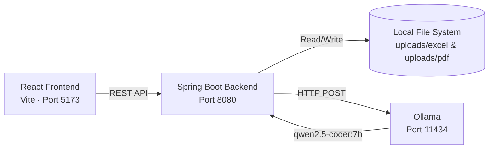

<div align="center">

# 📄 Document Updater

### AI-Powered Document Management System

**Upload, preview, download, and analyze your Excel & PDF documents with a locally running AI assistant.**

*Built with Spring Boot + React · Powered by Ollama (qwen2.5-coder:7b)*

[](https://openjdk.org/)
[](https://spring.io/projects/spring-boot)
[](https://react.dev/)
[](https://vite.dev/)
[](https://ollama.com/)

</div>

---

## 🎯 Overview

**Document Updater** is a full-stack web application that enables users to upload, preview, download, and **AI-analyze** Excel (`.xlsx`/`.xls`) and PDF documents. The application integrates with [Ollama](https://ollama.com/) running locally on your machine, using the **qwen2.5-coder:7b** model to provide intelligent document summaries and analysis — all without sending your data to any external server.

> 🔒 **Privacy First:** All AI processing happens locally on your machine. Your documents never leave your computer.

---

## ✨ Features

| Feature | Description |
|---|---|
| 📤 **File Upload** | Upload Excel (`.xlsx`, `.xls`) and PDF files via button click or **drag & drop** |
| 📥 **File Download** | Download uploaded documents with their original filenames preserved |
| 👁️ **PDF Preview** | In-app modal with embedded PDF viewer — preview before downloading |
| 🤖 **AI Analysis** | Analyze uploaded documents using a locally running Ollama AI model |
| 🌍 **Multi-Language** | Full Turkish 🇹🇷 and English 🇬🇧 language support with persistent preference |
| 🐙 **Animated Mascot** | Floating animated octopus mascot using sprite animation & Framer Motion |
| 🛡️ **Graceful Degradation** | App works fully even if Ollama is offline — AI features degrade gracefully |
| 📡 **Swagger/OpenAPI** | Auto-generated API documentation via Springdoc OpenAPI |
| 🎨 **Modern UI** | Clean, responsive design with hover effects, micro-animations & glassmorphism |

---

## 🏗️ Architecture

```
DocumentUpdater/
├── backend/                          # Spring Boot REST API (Java 17)
│   └── src/main/java/com/
│       ├── backend_app.java          # Application entry point
│       ├── file_route/
│       │   ├── file_route.java       # File upload/download REST controller
│       │   └── ai_route.java         # AI analysis REST controller
│       └── file_service/
│           ├── file_service.java     # File storage & retrieval logic
│           └── ai_service.java       # Ollama integration & text extraction
│
├── frontend/                         # React + Vite SPA
│   └── src/
│       ├── App.jsx                   # Main application component
│       ├── App.css                   # Full application styles
│       ├── FloatingOctopus.jsx       # Animated mascot component
│       ├── translations.js          # i18n translation dictionary (TR/EN)
│       └── main.jsx                  # React DOM entry point
│
└── README.md
```

### System Flow



---

## 🛠️ Tech Stack

### Backend
| Technology | Purpose |
|---|---|
| **Java 17** | Core language |
| **Spring Boot 4.1.0** | REST API framework |
| **Apache PDFBox 2.0.30** | PDF text extraction |
| **Apache POI 5.2.5** | Excel file parsing |
| **Springdoc OpenAPI 2.5.0** | Swagger API documentation |
| **Gradle** | Build & dependency management |

### Frontend
| Technology | Purpose |
|---|---|
| **React 19** | UI library |
| **Vite 8** | Build tool & dev server |
| **Framer Motion** | Smooth animations |
| **Vanilla CSS** | Custom styling |

### AI Engine
| Technology | Purpose |
|---|---|
| **Ollama** | Local LLM runtime |
| **qwen2.5-coder:7b** | Language model for document analysis |

---

## 🚀 Getting Started

### Prerequisites

- **Java 17+** — [Download](https://adoptium.net/)
- **Node.js 18+** — [Download](https://nodejs.org/)
- **Ollama** — [Download](https://ollama.com/download)

### 1. Clone the Repository

```bash
git clone https://github.com/<your-username>/DocumentUpdater.git
cd DocumentUpdater
```

### 2. Set Up the AI Model

```bash
# Install and start Ollama, then pull the model:
ollama pull qwen2.5-coder:7b
```

> **Note:** The AI analysis feature requires Ollama to be running on `localhost:11434`. If Ollama is not running, the app will still work — only AI features will be unavailable (graceful degradation).

### 3. Start the Backend

```bash
cd backend
./gradlew bootRun
```

The backend API will start on **`http://localhost:8080`**

### 4. Start the Frontend

```bash
cd frontend
npm install
npm run dev
```

The frontend will start on **`http://localhost:5173`**

### 5. Open the App

Navigate to **[http://localhost:5173](http://localhost:5173)** in your browser. 🎉

---

## 📡 API Endpoints

All endpoints are served under the base path `/api/files`.

| Method | Endpoint | Description |
|---|---|---|
| `POST` | `/api/files/upload/excel` | Upload an Excel file (`.xlsx`/`.xls`) |
| `POST` | `/api/files/upload/pdf` | Upload a PDF file |
| `GET` | `/api/files/download/excel` | Download the stored Excel file |
| `GET` | `/api/files/download/pdf` | Download the stored PDF file |
| `GET` | `/api/files/analyze/{fileType}?lang={tr\|en}` | AI analysis of the specified file type |

> 📘 **Swagger UI** is available at [`http://localhost:8080/swagger-ui.html`](http://localhost:8080/swagger-ui.html) when the backend is running.

---

## 🌍 Language Support

The application supports **Turkish** and **English** with a single-click toggle. Language preference is stored in `localStorage` and persists across sessions.

| Component | Turkish (TR) | English (EN) |
|---|---|---|
| UI Labels | ✅ | ✅ |
| AI Prompts | ✅ | ✅ |
| Error Messages | ✅ | ✅ |
| Help Guide | ✅ | ✅ |

---

## 🛡️ Graceful Degradation

The application is designed to be **resilient**. If the Ollama AI engine is offline or unreachable:

- ✅ File upload/download continues to work normally
- ✅ PDF preview continues to work normally
- ✅ Language switching works normally
- ⚠️ AI analysis buttons display a friendly informational message instead of crashing

This ensures core document management functionality is **always available**, regardless of the AI engine status.

---

## 📸 Screenshots

> *After running the application, you can access the main interface at `http://localhost:5173`.*
> 
> The interface features:
> - **Document panels** for Excel and PDF with drag & drop zones
> - **AI Assistant section** with analysis buttons for each file type
> - **PDF Preview modal** with embedded viewer and download option
> - **Help modal** with step-by-step usage guide
> - **Floating octopus mascot** that animates across the screen

---

## 🤝 Contributing

Contributions are welcome! Feel free to:

1. Fork the repository
2. Create a feature branch (`git checkout -b feature/amazing-feature`)
3. Commit your changes (`git commit -m 'Add amazing feature'`)
4. Push to the branch (`git push origin feature/amazing-feature`)
5. Open a Pull Request

---

## 📄 License

This project is open source and available under the [Non-Commercial](LICENSE).

---

